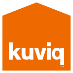

Hi! I'm **Julian Ca**icedo **Di**az.

Yes... I know, *"who is this guy?"*, right?

Well, I'm:

* **iOS** Developer
* **Computer Science BSc** (<a href="http://www.udea.edu.co" title="Universidad de Antioquia" target="_blank">*UdeA*</a> *-* <a href="https://www.informatik.kit.edu/" title="Karlsruhe Institut für Technologie" target="_blank">*KIT*</a>)
* Enthusiastic about **physics**
* **Trilingual** (*Native spanish, C1 certified german speaker, business-fluent english*)
* **Colombian** living in Germany
* <a href="https://www.padi.com/" title="Professional Association of Diving Instructors" target="_blank">PADI</a> Advanced Open Water Diver
* Underwater Rugby Player (yep, it's a <a href="https://en.wikipedia.org/wiki/Underwater_rugby" title="Underwater Rugby" target="_blank">thing</a>)

What I am **<u>NOT</u>**:

* The guy who will fix your printer
* That boring IT dude
* A radical human being
* A bad person

## *'So, what have you done, anyway?'*

I'm glad you ask.

* **'16 - present:** &nbsp;&nbsp;&nbsp;iOS Developer (<a href="https://www.biotronik.com" title="Biotronik SE & Co. KG" target="_blank">Biotronik</a>)
* **'15 - present:** &nbsp;&nbsp;&nbsp;iOS Developer & External Consultant (<a href="http://www.tekus.co/" title="Tekus S.A.S" target="_blank">Tekus</a>)
* **'14 - '15:** &nbsp;&nbsp;&nbsp;&nbsp;&nbsp;&nbsp;&nbsp;&nbsp;&nbsp;&nbsp;&nbsp;&nbsp;&nbsp;Mobile & Web Developer (<a href="https://www.ceiba.com.co/en/" title="Ceiba Software House" target="_blank">Ceiba Software House</a>)
* **'13 - '14:** &nbsp;&nbsp;&nbsp;&nbsp;&nbsp;&nbsp;&nbsp;&nbsp;&nbsp;&nbsp;&nbsp;&nbsp;&nbsp;Web Developer (<a href="https://www.tcs.com/" title="Tata Consultancy Services" target="_blank">Tata Consultancy Services</a>)
* **'12 - '12:** &nbsp;&nbsp;&nbsp;&nbsp;&nbsp;&nbsp;&nbsp;&nbsp;&nbsp;&nbsp;&nbsp;&nbsp;&nbsp;Intern - Web & Tool Developer (<a href="http://www.bosch-engineering.de/" title="Bosch Engineering" target="_blank">Bosch Engineering</a>)

I've done some freelance work too:

## *'What about your main superpowers?'*

Let's see...

**iOS**
* **Swift:** &nbsp;&nbsp;&nbsp;&nbsp;&nbsp;&nbsp;&nbsp;&nbsp;&nbsp;&nbsp;&nbsp;&nbsp;&nbsp;&nbsp;&nbsp;&nbsp;&nbsp;&nbsp;&nbsp;&nbsp;&nbsp;🌋🌋🌋🌋🌋🌋🌋🌋🗻🗻
* **Objective-C:** &nbsp;&nbsp;&nbsp;&nbsp;&nbsp;&nbsp;&nbsp;🌋🌋🌋🌋🌋🌋🌋🗻🗻🗻

**Android**
* **Java:** &nbsp;&nbsp;&nbsp;&nbsp;&nbsp;&nbsp;&nbsp;&nbsp;&nbsp;&nbsp;&nbsp;&nbsp;&nbsp;&nbsp;&nbsp;🌋🌋🌋🌋🌋🌋🌋🗻🗻🗻
* **Kotlin:** &nbsp;&nbsp;&nbsp;&nbsp;&nbsp;&nbsp;&nbsp;&nbsp;&nbsp;&nbsp;&nbsp;&nbsp;&nbsp;&nbsp;&nbsp;🌋🌋🌋🌋🗻🗻🗻🗻🗻🗻

**Web**
* **Spring & JSP:** &nbsp;&nbsp;&nbsp;&nbsp;&nbsp;&nbsp;&nbsp;&nbsp;&nbsp;&nbsp;🌋🌋🌋🌋🌋🌋🌋🌋🗻🗻
* **HTML & CSS:** &nbsp;🌋🌋🌋🌋🌋🌋🌋🗻🗻🗻
* **Javascript:** &nbsp;🌋🌋🌋🌋🌋🌋🌋🗻🗻🗻

So, if you want to know more about me or my work, please feel free to <a href="mailto:me@juliancadi.com" title="Contact me@juliancadi.com!">*contact me*</a> on any of the social media sites shown up next.

See you!

<ul class="post-list">

  <li><article><a href="{{ site.url }}{{ post.url }}">{{ post.title }} <time datetime="{{ post.date | date_to_xmlschema }}">{{ post.date | date: "%B %d, %Y" }}</time> {{ post.excerpt | remove: '\[ ... \]' | remove: '\( ... \)' | markdownify | strip_html | strip_newlines | escape_once }}</a></article></li>

</ul>
